<div align="center">

# ⏱ 정오 1분 전

**장비와 시간을 읽는 2D 픽셀 아트 전술 RPG**

정오 1분 전에 멈춰 버린 시계탑. 견습 탑지기 **하루**와 말하는 회중시계 **똑딱이**가<br>
녹에 먹힌 기계들을 1대1로 상대하며 꼭대기의 **녹슨 대진자**를 멈추러 올라간다.


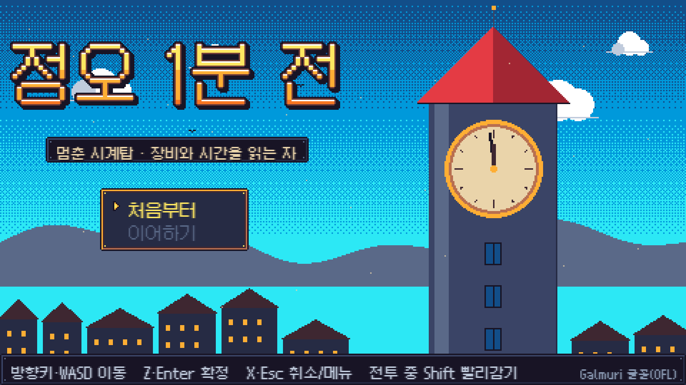

### [▶ 브라우저에서 바로 플레이](https://legerdo.github.io/noon-one-minute/)

</div>

---

## 어떤 게임인가요?

전투에서 **장비를 고르는 것이 곧 행동**입니다. 모든 장비에는 세 가지 값이 있습니다.

| 값 | 의미 |
|---|---|
| ⚔ **위력(Effect)** | 행동이 끝나는 순간 발생하는 피해·회복·지연 |
| 🛡 **방어(Defense)** | 그 장비를 **준비하는 동안** 적용되는 방어 |
| ⏳ **대기(Wait)** | 행동이 끝날 때까지 걸리는 논리 시간(틱) |

빠른 단검으로 틈을 찌르고, 위험한 순간에는 방패로 바꿔 들고, 적이 긴 동작에 들어가면 대망치를 떨어뜨립니다.
반사 신경이 아니라 **읽기와 판단**으로 이기는 게임입니다. 고르는 동안 시간은 멈춰 있습니다.

<div align="center">
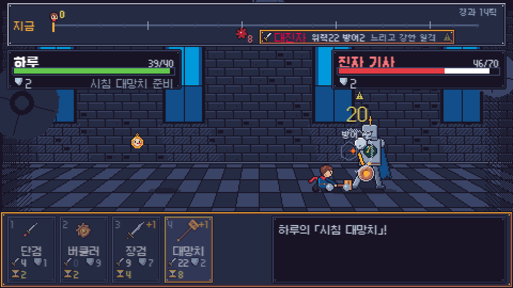
<br><sub>진자 기사의 「대진자」가 레일에서 8틱 뒤에 온다. 그 전에 대망치(위력 22)가 먼저 떨어진다.</sub>
</div>

## 스크린샷

| 탐험 | 전투 준비 · 관찰 기록 |
|:---:|:---:|
| 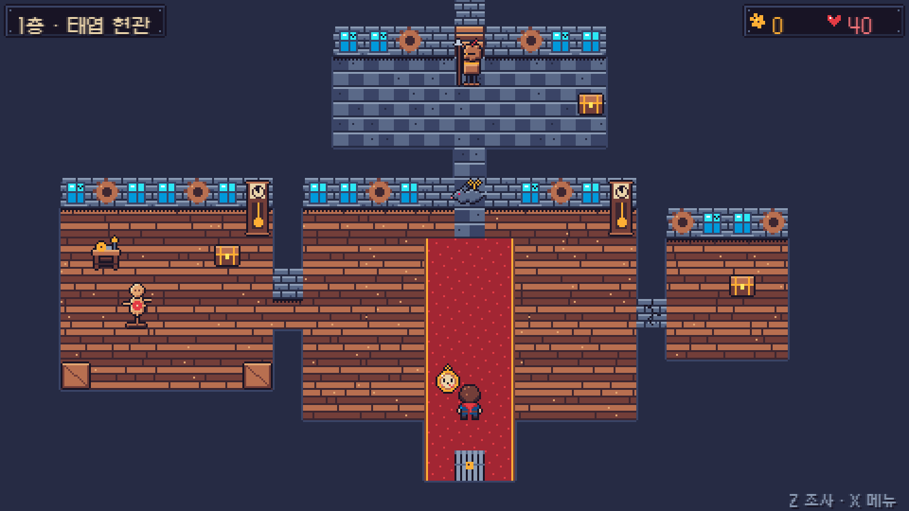 | 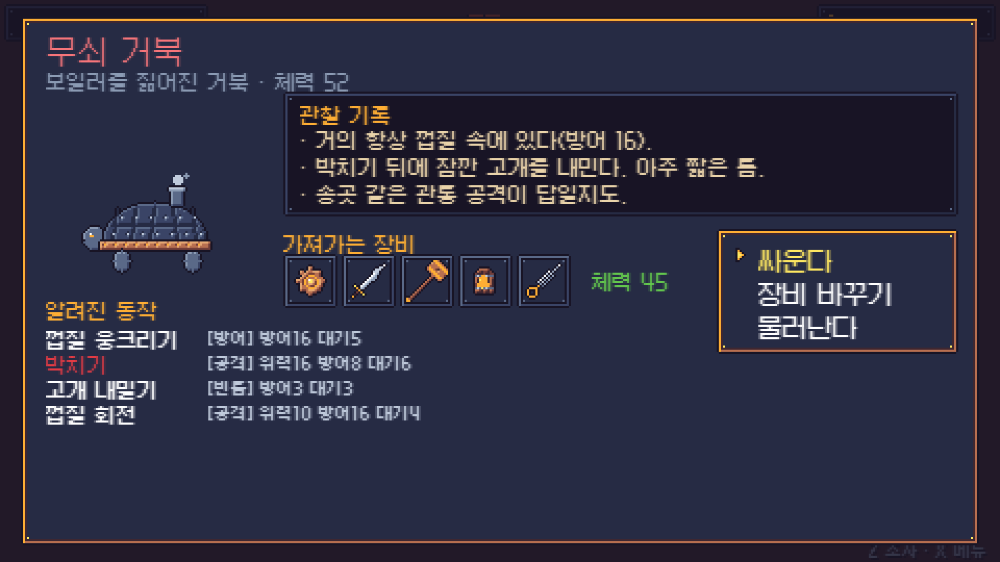 |
| **태엽 쥐 — 첫 전투** | **톱니 벌떼** |
| 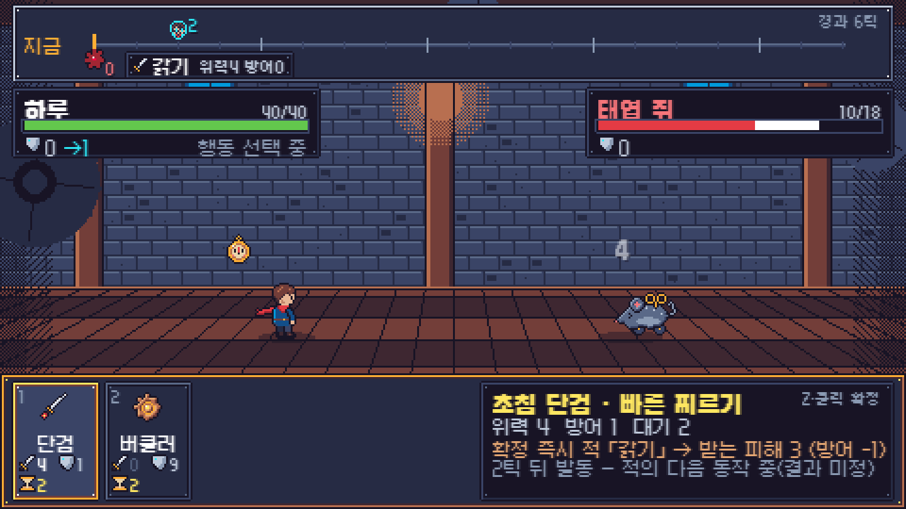 | 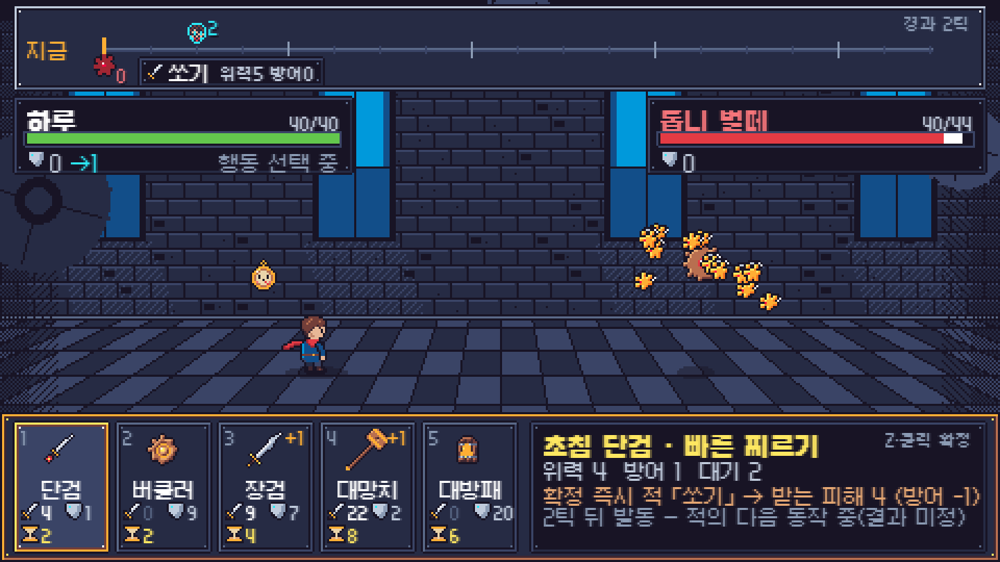 |
| **작업대 강화** | **숨은 방** |
| 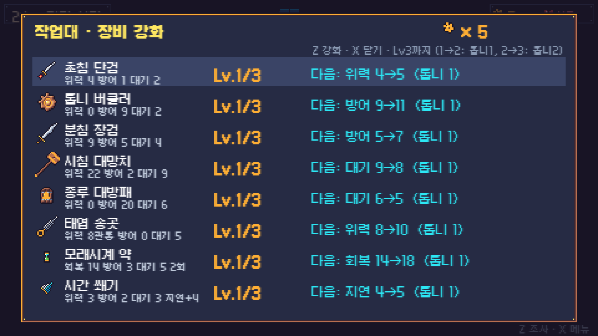 | 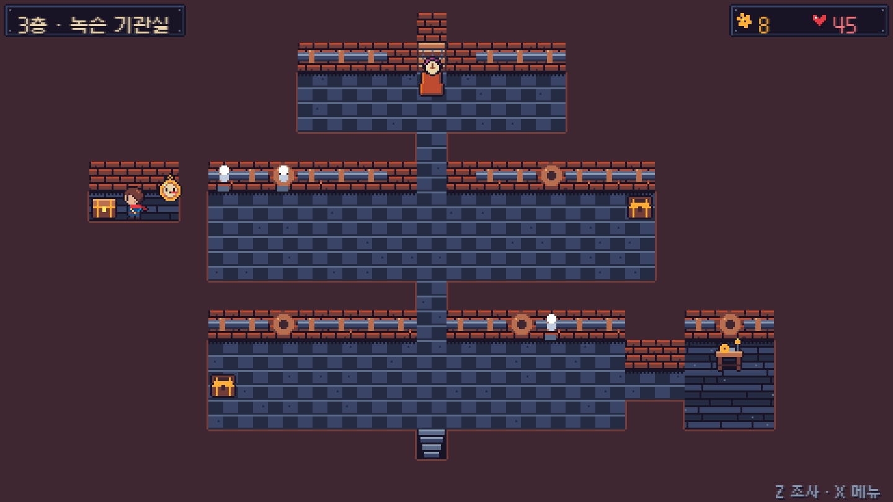 |
| **최종 보스 — 녹슨 대진자** | **패배와 재도전** |
| 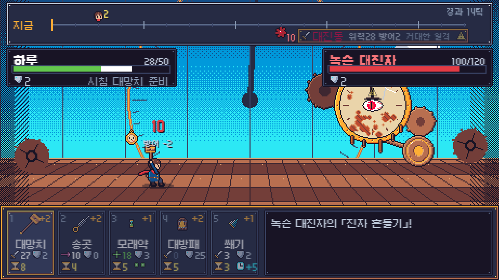 | 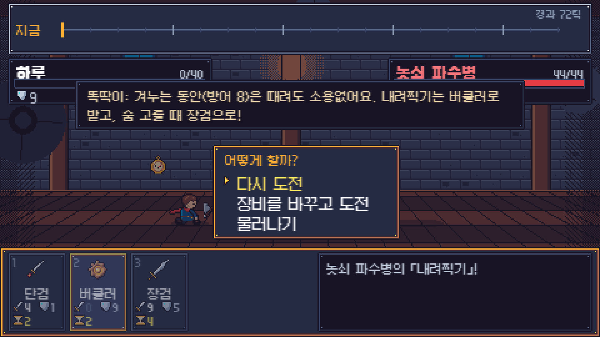 |

<div align="center">
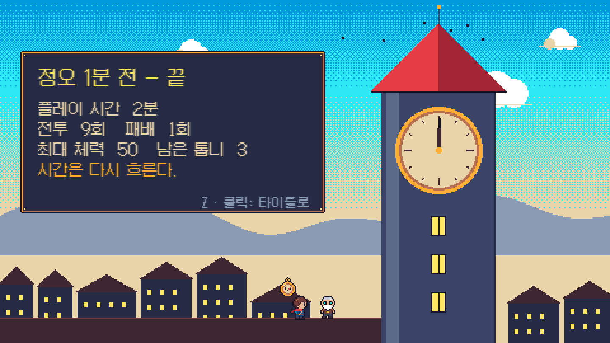
</div>

## 특징

- **시간 레일** — 하루와 적의 남은 대기가 한 줄 위에 흐릅니다. 적 표식 옆에는 "무엇을 할지"가 함께 붙어 있습니다.
- **확실한 결과만 보여 주는 미리보기** — 커서를 올리면 실제 전투 엔진을 복제 상태에서 돌려, 적이 다음 수를 정하기 전까지의 결과만 보여 줍니다.
- **읽을 수 있는 적** — 랜덤 없이 고정 패턴, 조건 반응, 체력 단계로 움직입니다. 적은 자기 동작이 끝날 때 **확정된** 내 행동만 보고 반응합니다.
- **8종의 장비, 5칸 로드아웃** — 단검 · 장검 · 대망치 · 버클러 · 대방패 · 관통 송곳 · 모래시계 약 · 시간 쐐기. 상위 호환 없이 역할이 다릅니다.
- **4개 층 탐험** — 상자, 금 간 벽(대망치로 파괴), 바람이 새는 숨은 통로, 태엽 심장(최대 체력 +5), 작업대.
- **3단계 보스** — 거대한 대진동 → 초침 폭주 연타 → 방패를 무시하는 「자정의 종」.
- **손맛** — 무기마다 다른 준비 자세와 접촉 프레임, 히트스톱, 방향 흔들림, 완전 방어·부분 방어·관통·회복·지연·처치에 각각 다른 시각·청각 피드백을 줍니다.
- **모든 아트는 코드로 그린 픽셀 아트**(Endesga 32 팔레트), **모든 소리는 WebAudio 합성**입니다. 외부 이미지·음원 파일이 없습니다.

## 시작하기

```bash
npm install
npm run dev        # http://localhost:5288
```

배포판 빌드와 미리보기:

```bash
npm run build
npm run preview    # http://localhost:5289
```

> Windows 11의 최신 데스크톱 브라우저(Chrome·Edge)에서 확인했습니다. 창 크기에 맞춰 정수 배율로 확대됩니다.

## 조작

| 입력 | 탐험 | 전투 |
|---|---|---|
| 방향키 / WASD | 이동 | 장비 포커스 이동 |
| 1 ~ 5 | – | 장비 포커스 (확정 아님) |
| Z / Enter / Space | 조사 · 대화 넘기기 | 장비 확정 |
| X / Esc | 메뉴 | 전투 메뉴(설정 · 규칙 · 후퇴) |
| Shift / F (누르고 있기) | – | 연출 빨리감기 |
| 마우스 | 메뉴 선택 | 올리면 미리보기, 클릭하면 확정 |

## 전투 규칙 한눈에

```text
Δt = min(내 남은 대기, 적 남은 대기)      ← 두 시간은 따로 흐르고, 남은 값은 보존된다
피해 = max(0, 위력 - 받는 쪽의 "현재" 방어)  ← 관통은 방어 무시
```

- 한 번 확정한 행동은 끝날 때까지 바꿀 수 없습니다. 적이 몇 번 움직여도 내 느린 공격은 계속 준비됩니다.
- **동시에 끝나면 플레이어가 먼저** 움직입니다. 적이 살아남았다면 그 공격은 내가 **새로 고른 장비의 방어**로 받습니다.
- 효과를 모두 적용한 직후에 사망을 판정합니다. 먼저 쓰러진 쪽의 행동은 실행되지 않습니다.
- 시간 쐐기의 지연은 같은 적 행동에 한 번만 걸립니다.

모든 세부 규칙은 [`DESIGN_LOCK.md`](DESIGN_LOCK.md)에 고정되어 있고, 코드와 테스트는 이 문서를 따릅니다.

## 프로젝트 구조

```text
src/
├─ core/        순수 전투 규칙 (Phaser 비의존) — engine, preview, ai, solver
├─ data/        장비 · 적 · 맵 · 대사
├─ game/        전투 세션(입력→엔진→사건 재생), 진행·보상 트랜잭션, 저장, 설정
├─ art/         픽셀 캔버스와 모든 스프라이트·타일·연출 생성기
├─ audio/       WebAudio 효과음과 시퀀서 음악
├─ battle/      전투 HUD · 적 표현 · 연출 도구
├─ world/       탐험 오버레이(전투 준비, 강화, 상태)
├─ ui/          입력 라우터, 메뉴, 대화창, 로드아웃, 폰트
└─ scenes/      Boot · Title · World · Battle · Ending
tests/          규칙 · 세션 · 진행 · 맵 · 밸런스 테스트
scripts/        Playwright 자동 플레이 · 스크린샷 도구
```

전투 엔진은 사건 목록(`intent → commit → advance → resolve → damage …`)을 만들고, 화면은 그 목록을 **재생만** 합니다.
연출 속도, 화면 흔들림, 빨리감기를 바꿔도 전투 결과는 바뀌지 않습니다.

## 테스트

```bash
npm test           # 규칙·세션·진행·맵·밸런스 (42개)
npm run balance    # 밸런스 보고서 출력
npm run e2e        # (dev 서버 실행 중) 실제 브라우저에서 처음부터 엔딩까지 자동 플레이
```

- **규칙 테스트**: 남은 시간 보존, 느린 행동 중 적 연속 행동, 준비 중 방어(18 - 14 = 4), 방패 해제 후 방어 소멸, 관통, 동률 처치, 동률 후 방패, 연출 독립성, 미리보기 순수성, 중복 입력.
- **밸런스 테스트**: 적마다 "최고 위력만 / 최단 대기만 / 최고 방어만 / 한 장비만"과 상대를 읽는 탐색 전략을 비교합니다. 단순 정책은 지거나 크게 손해를 봐야 통과합니다.
- **자동 플레이(E2E)**: 키보드와 마우스 입력만으로 전체 게임을 클리어하며 더블 클릭, 강화 연타, 재도전, 이어하기, 창 크기, 콘솔 오류를 확인합니다.

## 문서

- [`DESIGN_LOCK.md`](DESIGN_LOCK.md) — 구현 전에 고정한 전투·성장·진행 규칙
- [`docs/PROMPT.md`](docs/PROMPT.md) — 이 게임을 만들 때 사용한 원본 프롬프트
- [`docs/BUGFIXES.md`](docs/BUGFIXES.md) — 수정한 버그와 개선 목록

## 배포

GitHub Pages는 `gh-pages` 브랜치의 빌드 결과를 그대로 서비스합니다.

```bash
npm run deploy     # 빌드 → dist를 gh-pages 브랜치로 푸시
```

## 크레딧

- 글꼴: [Galmuri](https://github.com/quiple/galmuri) by Lee Minseo — SIL Open Font License 1.1
- 엔진: [Phaser 3](https://phaser.io/)
- 팔레트: Endesga 32
- 그 밖의 아트, 사운드, 음악, 코드는 이 프로젝트에서 직접 만들었습니다.
